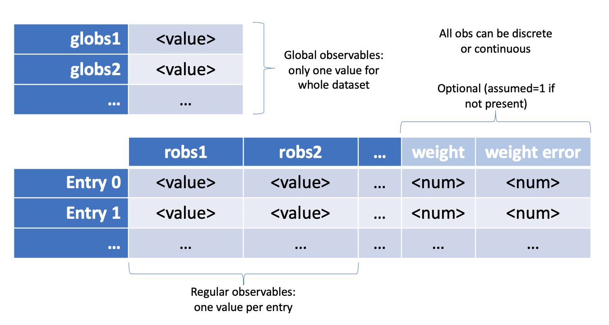

Day 1: Variables, Models, Datasets, Workspaces
===========

Today we introduce the terminology adopted throughout the rest of this course. We summarise of the basic building blocks of statistical analysis.

What do I mean by statistical analysis?
-----------------------------

For now I will work with the following description that will cover many of the common analyses performed in HEP

.. note:: Statistical Analysis:
    The process of making inferences about the values of parameters from a dataset of observables, using a parameterized probability model for the dataset. 

Therefore we need to understand the following terms: parameters, observables, models, datasets. 

Variables
---------
:ref:`Variables` are the fundamental entities from which :ref:`Models` and :ref:`Datasets` are built. A variable has a value that is not derived from any other variable, as opposed to a `function` which has its value derived from variables (or other functions). There are two types:

  * `continuous`: represented in RooFit by ``RooRealVar``, they can optionally have one or more named `ranges` associated to them, each range being defined by a lower and upper `bound`. 
  * `discrete` or `categorical`: represented in RooFit by ``RooCategory``, they have a finite set of possible values (states) defined for them.

Datasets
---------
:ref:`Datasets` consist of a set of values for a collection of variables. The variables that appear in a dataset are known as `observables`. You should think of a dataset as a table of values, where each observable is one column of the table, and the rows of the table are known as `entries` in the dataset. The entries of a dataset usually correspond to a single event, but an entry can also have a `weight` for when dealing with weighted data (the weights can also have an error, which can be used if calculating the `chi-squared` test statistic, which will be introduced below). Additionally, datasets can have a special list of observables called `global observables`, which can be thought of as like metadata for the dataset: their values are not specific to any entry, and are even defined if the dataset has no entries. The observables that are used as columns in the dataset are known as `regular observables`. Datasets are represented in RooFit by classes inheriting from ``RooAbsData``, of which ``RooDataSet`` is really the only one you need to know about. 

    
    A visual representation of a dataset.

Models
----------
`Models` are functions that evaluate to the probability density (or sometimes probability mass if all the observables are categorical) of observing an entry of a given dataset. This will include the probability of observing the global observable values of the dataset. Any variable that the model depends which isn't an observable is known as a `parameter`. We will learn below that models usually follow a common generic structure in HEP. Models are represented in RooFit by classes inheriting from ``RooAbsPdf``.

Parameters are in one of two possible states: they are either `floating` or `constant`. Parameters that can be in either state are `floatable` parameters. Non-floatable parameters must be `constant` - these types of parameters are also called `arguments`. All categorical parameters are deemed non-floatable. Additionally, continuous variables can be non-floatable if they are represented with a `RooConstVar` in RooFit. The constant parameters are also sometimes called the `consts` of the model, and the floating parameters are the `floats`.

Test Statistics
-------------
`Test Statistics` are functions that map a dataset onto a single value. They are usually constructed/defined using a model, thereby the parameters of the model are parameters of the test statistic.

Some, but not all, test statistics take the form of the summation of a quantity over the entries of the dataset and therefore the calculation can readily be parallelized across the entries. Such batch-computable test statistics are represented in RooFit by classes inheriting from `RooAbsTestStatistic`. Two such statistics are:

  * `Negative Log Likelihoood`: represented by  ``RooNLLVar`` in RooFit.
  * `chi-squared`: represented by ``RooXYChi2Var`` in RooFit.

Objective functions
-------------
`Objective Functions` are :ref:`Test Statistics` that are desirable to minimize with respect to the parameters. The term `objective function` is used in machine learning for functions that are designed to be extremised.

Fit Results
------------
`Fit Results` represent the result of a minimization of an `objective function` through varying its floating parameters. In RooFit fit results are represented by the ``RooFitResult`` class, and it holds the initial and final floating parameter values of the objective function, along with the constant parameter values, the minimized objective-function value with an estimate of the difference to the true minimum, and a status code to indicate whether the minimization was successful or not. Fit Results can also hold estimates floating parameter errors, along with status codes for the algorithms that estimate these errors.

Workspaces
------------
A workspace is a collection of one or more models with one or more datasets. The observables of a workspace are all the observables of the datasets. The parameters of a workspace are all the other variables of the models in the workspace. In RooFit these are the class ``RooWorkspace``. These can also store fit results and any other type of ROOT object.

Summary of types of variable
----------------------------
The table below summarises the different type of variable described above:

+-----------+----------+-----------------------------------------------------------------------------------------------------+
|           | regular  | Columns of a dataset, can have different value for each entry.                                      |
|observable |----------+-----------------------------------------------------------------------------------------------------+
|           | global   | Metadata of a dataset, same value for every entry (can be defined even if no entries in the datset).|
+-----------+----------+-----------+-----------------------------------------------------------------------------------------+
|           |          | floating  | Non-constant floatable non-observables of a model (with a given dataset).               |
|           | floatable|-----------+-----------------------------------------------------------------------------------------+
| parameter |          |           | Constant-floatable non-observables of a model (with a given dataset).                   |
|           |----------| constant  |-----------------------------------------------------------------------------------------|
|           | arugment |           | Constant non-floatable non-observables of a model (with a given dataset).               |
+-----------+----------+-----------+-----------------------------------------------------------------------------------------+

Additionally, for statistical analysis purposes, one or more parameters can be labelled `parameters of interest` (poi). The remaining parameters are deemed the `nuisance parameters` (np).

Exercises
----------------------------
 
Working with workspaces
^^^^^^^^^^^^^^^^^^^^^^^
Here are some ways to load a workspace into an `xRooNode`:
 
>>> w = ROOT.xRooNode("filename.root")
>>> f = ROOT.TFile("filename.root"); ws = f.Get("wsname"); w = ROOT.xRooNode(ws) # assumes wsname is name of workspace in file
 
Once you have an `xRooNode` that wraps a workspace you can use methods of the node to access the different variables:

======== =================
vars()   List of variables
obs()    List of observables
robs()   List of regular observables
globs()  List of global observables
pars()   List of parameters
floats() List of floating parameters
consts() List of non-floating parameters
poi()    List of parameters of interest
np()     List of nuisance parameters (parameters that aren't poi)
======== =================
